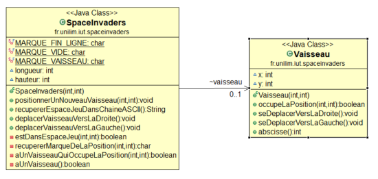
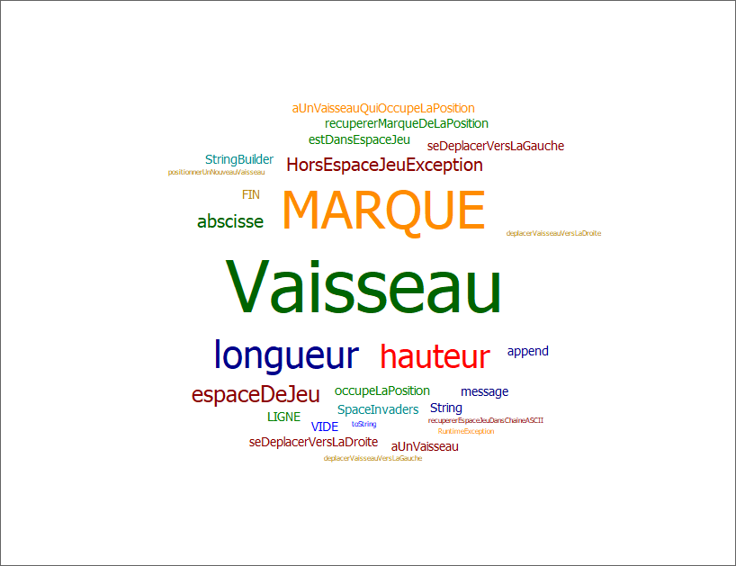
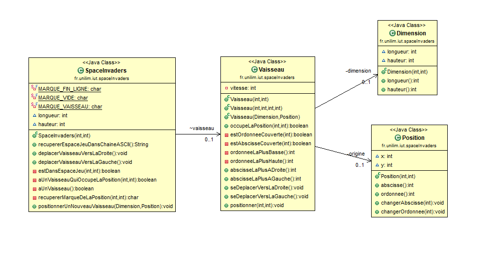
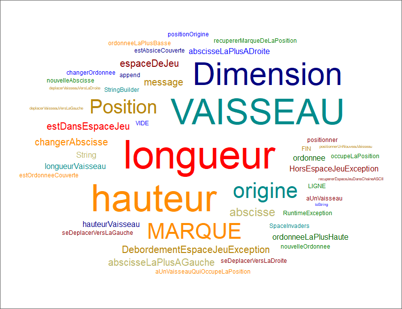

# Space Invaders

**Space Invaders** est un jeu de tir spatial fixe en deux dimensions (**2D**). Le joueur contrôle un **vaisseau spatial** muni d'un canon laser qu'il peut déplacer horizontalement, au bas de l'écran. Dans les airs, des rangées d'aliens (**ennemis**) se déplacent latéralement tout en se rapprochant progressivement du sol et en lançant des **missiles**. L'objectif est de détruire avec le canon laser les vagues ennemies, qui se composent de cinq rangées de onze aliens chacune, avant qu'elles n'atteignent le bas de l'écran. Le joueur gagne des points à chaque fois qu'il détruit un envahisseur. Le jeu n'autorise qu'**un tir** à la fois et permet d'annuler ceux des ennemis en tirant dessus. La vitesse et la musique s'accélèrent au fur et à mesure que le nombre d'aliens diminue. L'élimination totale de ces derniers amène une nouvelle vague ennemie plus difficile, et ce indéfiniment. Le jeu ne se termine que lorsque le joueur perd, ce qui en fait le premier jeu sans fin. Les aliens tentent de détruire le canon en tirant dessus pendant qu'ils s'approchent du bas de l'écran. S'ils l'atteignent ou arrivent jusqu'au sol, ils ont réussi leur invasion et le jeu est fini. De temps en temps, un vaisseau spatial apparait tout en haut de l'écran et fait gagner des points bonus s'il est détruit. Quatre bâtiments destructibles permettent au joueur de se protéger des tirs ennemis. Ces défenses se désintègrent progressivement sous l'effet des projectiles adverses et de ceux du joueur. Le nombre de bâtiments n'est pas le même d'une version à l'autre.

## Sommaire
* [Semaine 1 : 30 Mars au 5 Avril 2020](#semaine1)
* [Semaine 2 : 6 au 12 Avril 2020](#semaine2)

## Semaine du 30 mars au 5 avril  
#### Fonctionnalité n°1 : Déplacer un vaisseau dans l'espace de jeu (fini)
- Story n°1 : Créer un espace de jeu  
Un espace de jeu est créé aux dimensions données (2D) 
Cet espace de jeu est vide

-  Story n°2 : Positionner un nouveau vaisseau dans l’espace de jeu  
Un nouveau vaisseau est créé
Le vaisseau est positionné aux coordonnées transmises
Si un nouveau vaisseau essaye d’être positionné en dehors des limites de l’espace jeu, alors une exception devra être levée.
 Contraintes :
La position souhaitée est transmise par ses coordonnées x et y.
Le coin supérieur gauche de l’espace jeu (point en haut à gauche) a pour coordonnées (0,0)
La taille du vaisseau est réduite pour l'instant à son minimum (1 seul point)    

- Story n°3 : Déplacer le vaisseau vers la droite dans l'espace de jeu  
Le vaisseau se déplace d'un pas vers la droite 
Si le vaisseau se trouve sur la bordure droite de l'espace de jeu, le vaisseau doit rester immobile (aucun déplacement, aucune exception levée : le vaisseau reste juste à sa position actuelle).

- Story n°4 : Déplacer le vaisseau vers la gauche dans l'espace de jeu  
Le vaisseau se déplace d'un pas vers la gauche 
Si le vaisseau se trouve sur la bordure gauche de l'espace de jeu, le vaisseau doit rester immobile (aucun déplacement, aucune exception levée : le vaisseau reste juste à sa position actuelle).

### Fonctionnalité en cours d’implémentation : 
Aucune

### Diagramme de classes 

### Nuage de mots du projet spaceinvaders (séance n°1)  
(généré à l’aide de Source Code Word Cloud Generator avec la liste JavaBlacklist.txt fournie en annexe)
 

### Difficultés rencontrées 
Aucune

### Remarques diverses
 Pour pouvoir, mettre en place les tests, il a été nécessaire d’ajouter une fonctionnalité supplémentaire qui permet de représenter l’espace de jeu dans une chaîne ASCII.

-------------

## Semaine du 6 au 12 Avril 2020  
#### Fonctionnalité n°2 : Dimensionner le vaiseau (fini)
- Story n°1 : Positionner un nouveau vaisseau avec une dimension donnée

-  Story n°2 : Faire en sorte qu'il soit impossible de positionner un nouveau vaisseau qui déborde de l'espace de jeu

- Story n°3 : Déplacer un vaisseau vers la droite en tenant compte de sa dimension

- Story n°4 : Déplacer un vaisseau vers la gauche en tenant compte de sa dimension

### Fonctionnalité en cours d’implémentation : 
Aucune

### Diagramme de classes 

### Nuage de mots du projet spaceinvaders (séance n°2)  
(généré à l’aide de Source Code Word Cloud Generator avec la liste JavaBlacklist.txt fournie en annexe)
 

### Difficultés rencontrées 
Aucune

### Remarques diverses
Aucune

-------------
